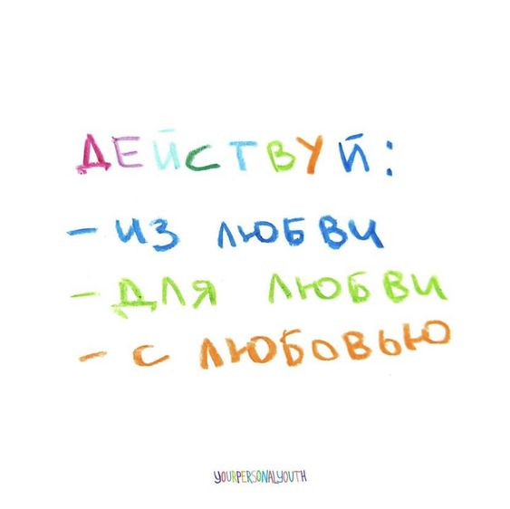
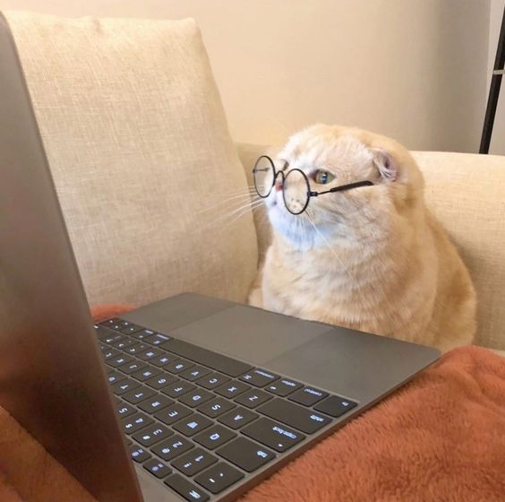

# web6405kapkaevaao
Лабораторные работы по "Веб программированию"

💫 Привет, меня зовут Капкаева Ангелина Олеговна, я студент группы 6405-010302D.

👩‍💻 Обо мне
Я студентка, увлеченная наукой и технологиями. В этом репозитории вы найдете проекты, над которыми я работала, а также одну из любимых цитат и милые картинки.

👨‍🏫 Научный руководитель
Мой научный руководитель: **Парингер Рустам Александрович, кандидат
технических наук, доцент кафедры технической кибернетики**.

📖 Тема научно исследовательской работы: Исследование алгоритмов
обучения нейронной сети для распознавания изображений компьютерной
томографии

## Страх перед именем усиливает страх перед тем, кто его носит. — Гермиона Грейнджер

web6405kapkaevaao/images/1.jpg

#Только сели за лабу

#ПМИ-шник пишет лабу

#После лаб

---
